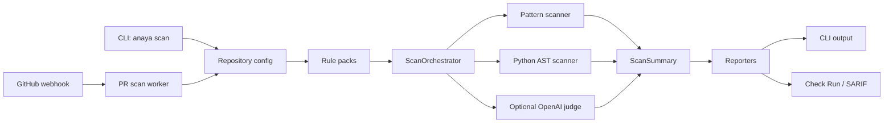
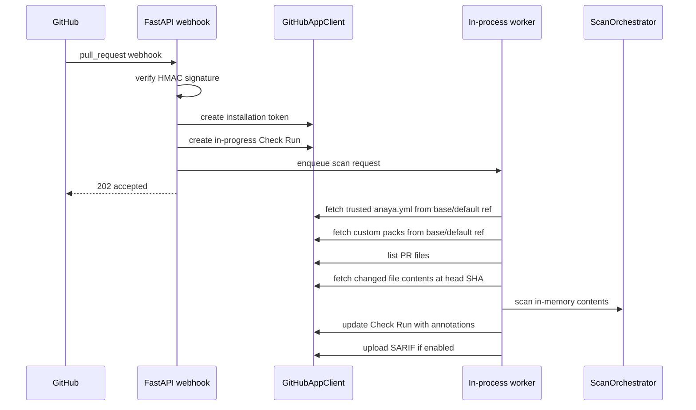

# Anaya Technical Architecture And Implementation Guide

This document is the engineering handoff for Anaya as implemented in this
repository. It is meant for a developer who understands the product spec and now
needs to understand the code well enough to run it, modify it, review it, and
prepare it for production.

It is not a deployment guide. Deployment/demo readiness starts in M10 and has
not been implemented yet. For focused setup docs, also see:

- `docs/GITHUB_APP.md`
- `docs/GITHUB_ACTION.md`
- `docs/PACK_AUTHORING.md`
- `docs/LLM_RULES.md`
- `docs/MANUAL_CHECKS.md`
- `docs/IMPLEMENTATION_PLAN.md`

## 1. Product Shape

Anaya is a policy-pack-agnostic compliance-as-code engine. The V1 product has
two surfaces over the same engine:

- OSS CLI: local developer and CI usage through `anaya scan`, similar in spirit
  to Semgrep.
- GitHub App: pull request scanning with Check Runs, annotations, and optional
  SARIF upload.

The engine is intentionally not RBI-specific, not hardcoded to one regulation,
and not AI-first. Policy behavior lives in YAML rule packs. The Python code
implements scanner mechanics, configuration, reporting, and host integrations.

Current implementation state:

- Engine, CLI, reporters, generic packs, Python AST scanning, GitHub App
  foundation, in-process PR scan worker, and optional OpenAI judge are present.
- Redis/Celery, Docker, deployment docs, live ngrok verification, live SARIF
  upload verification, JavaScript AST scanning, and hosted retry hardening are
  not implemented yet.
- OpenAI is the only LLM provider supported. There is no Gemini integration.

## 2. Repository Map

Important paths:

| Path | Purpose |
| --- | --- |
| `anaya/engine/models.py` | Dataclasses for rules, packs, violations, scan results, and summaries. |
| `anaya/engine/rule_loader.py` | YAML pack parsing and validation. |
| `anaya/engine/repo_config.py` | `anaya.yml` discovery, parsing, and validation. |
| `anaya/engine/orchestrator.py` | File collection, rule selection, scanner routing, summary building. |
| `anaya/engine/scanners/pattern.py` | Regex scanner and language detection by extension. |
| `anaya/engine/scanners/ast_scanner.py` | Python function-level AST scanner. |
| `anaya/packs/generic/*.yml` | Bundled OSS rule packs. |
| `anaya/cli/main.py` | Typer CLI commands and scan context loading. |
| `anaya/reporter/*.py` | Table, JSON, SARIF, audit JSON, Check Run, and PR comment output. |
| `anaya/api/*.py` | FastAPI app, webhook handling, GitHub auth/client, HMAC security. |
| `anaya/worker/pr_scan.py` | In-process PR scanner used by the GitHub App route. |
| `anaya/worker/tasks.py` | Dispatcher interface and in-process background dispatcher. |
| `anaya/llm/*.py` | Optional OpenAI judge and prompt/schema construction. |
| `tests/` | Unit and integration-style tests with mocked external systems. |
| `docs/` | Setup, authoring, manual checks, implementation plan, and this guide. |

## 3. High-Level Architecture

The CLI and GitHub App share the same scan engine.



Core principles in the implementation:

- YAML is the rule source of truth.
- Deterministic scanners run by default.
- LLM rules are opt-in and skipped safely when unavailable.
- The GitHub App fetches `anaya.yml` and custom packs from the trusted
  base/default branch, not from untrusted PR code.
- The engine never executes scanned code.
- Reporters are pure formatters over `ScanSummary`.

## 4. Core Data Model

The main types are in `anaya/engine/models.py`.

`RulePack`

- `id`: pack namespace, for example `generic/secrets-detection`.
- `version`: SemVer string.
- `name`, `description`, `path`.
- `rules`: tuple of `Rule`.

`Rule`

- `id`, `name`, `description`.
- `type`: `pattern`, `ast`, or `llm`.
- `severity`: `INFO`, `LOW`, `MEDIUM`, `HIGH`, or `CRITICAL`.
- `languages`: tuple of supported languages.
- `patterns`: regex patterns for `pattern` rules.
- `raw`: original rule mapping, used by AST and LLM scanners for type-specific
  metadata.

`Violation`

- Rule identity, severity, file path, line/column, snippet, message, fix hint,
  references, pack ID, and confidence.
- Deterministic scanners use confidence `1.0`.
- LLM findings use the model-reported confidence.

`ScanResult`

- Per-file result with file path, violations, rules checked, and duration.

`ScanSummary`

- Whole-scan result with totals, severity counts, pack stats, status, skipped
  file counts, config path, pack versions, warnings, and per-file results.
- `overall_status` is derived from thresholds. Findings at or above `fail_on`
  make the scan `FAIL`; findings at or above `warn_on` make it `WARN` unless it
  is already failing.

## 5. Rule Packs

Rule packs are YAML files loaded by `load_rule_pack` in
`anaya/engine/rule_loader.py`.

Required pack shape:

```yaml
pack:
  id: custom/example
  version: 1.0.0
  name: Example Pack
  description: Example user-authored policies

rules:
  - id: CUSTOM-001
    name: Example Rule
    description: What the rule detects
    type: pattern
    severity: HIGH
    languages: [python]
    patterns:
      - regex: "dangerous_call\\("
    message: "Dangerous call at line {line}."
    fix_hint: "Replace the dangerous call."
```

Validation currently enforces:

- YAML mapping at the top level.
- Required `pack.id` and `pack.version`.
- SemVer pack versions.
- Non-empty `rules`.
- Unique rule IDs per pack.
- Valid severities.
- Valid supported languages.
- Valid regex patterns and excludes.
- Reference entries must contain `url` and `title`.
- AST rules must use the supported function schema.
- LLM rules must define `llm.scope` and `llm.prompt`.

Built-in packs are resolved by ID, for example `generic/owasp-top10`, through
`resolve_pack_identifier`. Custom packs can be passed by path or listed in
`anaya.yml`. Paths in `anaya.yml` resolve relative to the config file.

Current bundled packs:

- `generic/secrets-detection`: 6 rules.
- `generic/owasp-top10`: 8 rules.
- `generic/pii-handling`: 5 rules.
- `generic/tls-encryption`: 4 rules.
- `generic/audit-logging`: 3 pattern rules and 3 Python AST rules.

Total built-in rules: 29.

## 6. Repository Config

Repository config is loaded from `anaya.yml` by `load_repository_config`.
Discovery starts from the scan path and walks up parent directories.

Default packs:

```yaml
packs:
  - id: generic/secrets-detection
  - id: generic/owasp-top10
  - id: generic/pii-handling
  - id: generic/tls-encryption
  - id: generic/audit-logging
```

Common config:

```yaml
version: "1"

packs:
  - id: generic/secrets-detection
  - id: policies/custom.yml

scan:
  mode: diff
  languages: [python, javascript]

thresholds:
  fail_on: CRITICAL
  warn_on: HIGH

ignore:
  paths:
    - "tests/**"
    - "node_modules/**"
  rules:
    - ANAYA-SEC-006

llm:
  enabled: false
```

Validated config fields:

- `packs` must be a non-empty list of strings or mappings with `id`.
- `scan.mode` must be `diff` or `full`.
- `scan.languages` must use supported language names.
- `thresholds.fail_on` and `thresholds.warn_on` must be valid severities.
- `ignore.paths` and `ignore.rules` must be string lists.
- ignored rules must exist in the selected packs.
- `llm.enabled` must be boolean.

Note: `scan.mode` is validated but the CLI currently decides diff behavior from
the explicit `--diff REF` option. The GitHub App currently scans changed PR
files.

## 7. Scan Orchestration

`ScanOrchestrator` coordinates the scan.

Local file flow:

1. `scan_paths` calls `collect_files`.
2. Files are filtered by ignore patterns, supported extension, language filter,
   size limit, and binary detection.
3. Active rules are selected after ignored rules, language filtering, and LLM
   availability filtering.
4. Each file is read as UTF-8 with replacement for invalid bytes.
5. Pattern scanner runs.
6. Python AST scanner runs.
7. Optional LLM judge runs if configured.
8. Violations are sorted and summarized.

In-memory flow:

- `scan_contents` accepts `list[tuple[file_path, content]]`.
- It is used by the GitHub worker so PR files can be scanned without writing
  untrusted source into the repo checkout.
- It still applies supported extension and language filters.

File collection details:

- Default ignores include `.git`, virtualenv directories, `node_modules`,
  `dist`, `build`, and generated files.
- Maximum file size is `1_000_000` bytes.
- Binary files are skipped when the first 2048 bytes contain `NUL`.
- Supported extensions live in `LANGUAGE_BY_SUFFIX` in
  `anaya/engine/scanners/pattern.py`.

## 8. Pattern Scanner

`PatternScanner` implements deterministic line-by-line regex rules.

Behavior:

- Detects language by file extension.
- Applies only `type: pattern` rules whose languages include the detected
  language, or have no language restriction.
- Checks inline suppressions before matching.
- Supports pattern-level `exclude_patterns`.
- Dedupes repeated matches by `(rule_id, line_number, line text)`.
- Builds `Violation` objects with rendered message templates.

Supported suppression forms include:

- `# noqa: RULE_ID`
- `// noqa: RULE_ID`
- `# noqa: anaya`
- `// noqa: anaya`
- `anaya: ignore RULE_ID`

Suppression is broad for `anaya: ignore`: the current implementation treats it
as suppressing all Anaya findings on that line.

## 9. Python AST Scanner

`AstScanner` handles structural rules that regex cannot express cleanly.

Current scope:

- Python only.
- Function and async-function nodes.
- Top-level functions only; functions directly inside classes are skipped.
- Used by audit logging rules to detect missing audit calls in transaction,
  authentication, and deletion flows.

Supported AST rule shape:

```yaml
type: ast
languages: [python]
ast:
  node_type: function
  name_matches: "(transfer|refund)"
  must_contain:
    - "(audit|record_audit|emit_audit)"
  if_missing: flag
```

If Python parsing fails, the scanner returns no findings instead of crashing.
JavaScript/TypeScript AST support is intentionally deferred.

## 10. Optional OpenAI Judge

OpenAI support lives in `anaya/llm`. It is optional, OpenAI-only, and disabled
by default.

Activation requires both:

- `llm.enabled: true` in the trusted repository config.
- `ANAYA_OPENAI_API_KEY` in environment settings.

If the config opts in but OpenAI is unavailable, Anaya adds a scan warning and
skips LLM rules. It never creates a violation by default.

Rule shape:

```yaml
type: llm
severity: HIGH
languages: [python]
llm:
  scope: file
  prompt: "Decide whether this code clearly records audit evidence."
message: "OpenAI judge returned {status}: {reason}"
fix_hint: "Add explicit audit evidence or replace this with a deterministic rule."
```

Supported scopes:

- `file`: sends one file as one bounded judgment task.
- `function`: sends each Python function as a bounded task.

Runtime guards in `OpenAIJudge`:

- Uses the OpenAI Responses API.
- Structured JSON output schema with `PASS`, `WARN`, `FAIL`, `confidence`,
  `reason`, and optional `line_number`.
- Output tokens capped at 300.
- Temperature capped at 0.1.
- Timeout capped at 10 seconds.
- SDK retries disabled; Anaya performs one retry for 429 or 5xx.
- Invalid JSON, invalid schema values, timeouts, missing keys, dependency
  absence, and API errors become warnings.
- `PASS` produces no finding. `WARN` and `FAIL` produce findings using the
  rule severity.

Important data-handling note: when LLM rules are enabled, the source in the
configured scope is sent to OpenAI. Do not enable LLM rules unless that is
acceptable for the repository.

## 11. CLI Surface

The CLI is implemented with Typer in `anaya/cli/main.py`.

Commands:

```bash
anaya scan PATH
anaya scan PATH --diff origin/main
anaya scan PATH --format sarif -o anaya.sarif
anaya scan PATH --format audit-json
anaya scan PATH --format check-run
anaya scan PATH --format pr-comment
anaya test-rule --rule RULE_ID --file FILE
anaya init
anaya validate-pack PATH
anaya packs list
```

CLI scan flow:

1. Discover or load config unless `--no-config` is passed.
2. Determine pack IDs from `--pack` or config.
3. Resolve pack paths.
4. Configure optional LLM judge only if config enables LLM.
5. Create `ScanOrchestrator`.
6. If `--diff REF` is used, resolve changed files through `git diff`.
7. Run the scan.
8. Render requested format.
9. Exit `1` when `summary.overall_status == "FAIL"`, otherwise `0`.

Invalid config, unknown packs, invalid packs, and bad formats are surfaced as
Typer usage errors.

## 12. GitHub App Surface

The FastAPI app is built by `create_app` in `anaya/api/app.py`.

Routes:

- `GET /health`: health response.
- `POST /webhook`: GitHub webhook receiver.

Webhook flow:



Accepted webhook events:

- Event: `pull_request`.
- Actions: `opened`, `reopened`, `synchronize`.

Ignored events and actions return HTTP 200 with `status: ignored`.

Security behavior:

- `X-Hub-Signature-256` is verified with HMAC-SHA256 in
  `anaya/api/security.py`.
- Missing webhook secret returns 500.
- Invalid signatures return 403.
- Malformed webhook payloads return 400.
- GitHub App private key can be read from raw env text or a file path.
- App JWTs are generated with RS256 and a short expiration.

Current GitHub permissions needed:

- Checks: read/write.
- Contents: read.
- Pull requests: read.
- Metadata: read.
- Security events or code scanning write permission when SARIF upload is
  enabled.

## 13. PR Worker Details

`PullRequestScanner` in `anaya/worker/pr_scan.py` is the current PR scan worker.
It runs inside FastAPI background tasks through `InProcessScanDispatcher`.

Worker steps:

1. Create installation token.
2. Reuse webhook-created Check Run ID or create one.
3. Choose config ref: `base_ref`, then `default_branch`, then `main`.
4. Fetch `anaya.yml` from the trusted config ref.
5. If no config exists, use default repository config.
6. Fetch repo-relative custom pack files referenced in config from the trusted
   config ref.
7. Load repository config and rule packs from a temporary directory.
8. Create optional OpenAI judge if trusted config enables LLM.
9. List changed PR files.
10. Skip removed files and unsupported extensions.
11. Fetch supported file content at the PR head SHA.
12. Run `scan_contents`.
13. Build Check Run payloads and update GitHub.
14. Upload SARIF if `ANAYA_GITHUB_UPLOAD_SARIF=true`.

Why config comes from base/default branch:

- PR code is untrusted.
- A malicious PR should not be able to disable packs, lower thresholds, ignore
  rules, or enable LLM data egress by editing `anaya.yml` in the PR branch.

Known worker gaps before production:

- No Redis/Celery queue yet.
- No token cache yet.
- No retry/backoff wrapper for GitHub 401, 429, or 5xx yet.
- Failure-path Check Run updates are not fully hardened. A worker exception can
  still leave a Check Run in progress.
- Fork PR SARIF refs may need additional handling.
- No live GitHub App/ngrok test has been run in this repo state.

## 14. Reporters

Reporters are pure functions over `ScanSummary`.

| Reporter | File | Output |
| --- | --- | --- |
| Table | `anaya/reporter/table.py` | Human-readable CLI text. |
| JSON | `anaya/reporter/json_report.py` | Dataclass JSON for automation. |
| SARIF | `anaya/reporter/sarif.py` | SARIF 2.1.0 for GitHub Code Scanning. |
| Audit JSON | `anaya/reporter/audit_json.py` | Audit-oriented grouped JSON. |
| Check Run | `anaya/reporter/check_run.py` | GitHub Check Run update payloads. |
| PR Comment | `anaya/reporter/pr_comment.py` | Optional Markdown summary. |

Check Run output:

- Converts Anaya status to GitHub conclusion:
  - `FAIL` -> `failure`.
  - `WARN` -> `neutral`.
  - `PASS` -> `success`.
- Maps severity to annotation level.
- Batches annotations at GitHub's 50-annotation limit.
- Includes warnings in the Check Run summary.

SARIF output:

- Emits SARIF 2.1.0.
- Includes tool metadata, rule metadata, help URI when present, locations,
  regions, automation details, invocation metadata, and stable partial
  fingerprints.
- GitHub upload uses gzip-compressed, base64-encoded SARIF.

## 15. Runtime Settings

Settings live in `anaya/config.py` and are loaded from `ANAYA_*` environment
variables through `pydantic-settings`.

Important settings:

| Setting | Purpose |
| --- | --- |
| `ANAYA_GITHUB_APP_ID` | GitHub App ID. |
| `ANAYA_GITHUB_PRIVATE_KEY` | Raw PEM text, with escaped `\n` accepted. |
| `ANAYA_GITHUB_PRIVATE_KEY_PATH` | PEM file path alternative. |
| `ANAYA_GITHUB_WEBHOOK_SECRET` | Webhook HMAC secret. |
| `ANAYA_GITHUB_API_URL` | API base, defaults to GitHub public API. |
| `ANAYA_GITHUB_UPLOAD_SARIF` | Enables SARIF upload in App mode. |
| `ANAYA_REDIS_URL` | Reserved for hosted queue milestone. |
| `ANAYA_OPENAI_API_KEY` | Enables OpenAI judge when repo config opts in. |
| `ANAYA_OPENAI_MODEL` | Defaults to `gpt-4o-mini`. |
| `ANAYA_OPENAI_MAX_TOKENS` | Capped at 300. |
| `ANAYA_OPENAI_TEMPERATURE` | Capped at 0.1. |
| `ANAYA_OPENAI_TIMEOUT_SECONDS` | Capped at 10 seconds. |
| `ANAYA_HOST`, `ANAYA_PORT`, `ANAYA_LOG_LEVEL` | Server settings reserved for hosted mode. |

## 16. Testing Strategy

Tests are under `tests/` and use local fixtures plus mocked external systems.

Major test groups:

- `test_rule_loader.py`: pack schema validation.
- `test_repo_config.py`: repository config validation.
- `test_pattern_scanner.py`: regex matching, suppressions, dedupe.
- `test_ast_scanner.py`: Python structural audit rules.
- `test_orchestrator.py`: summaries, skipped files, languages, in-memory scans.
- `test_generic_packs.py`: dirty/clean fixture matrix.
- `test_reporters.py`: JSON, table, SARIF, Check Run, PR comment contracts.
- `test_cli.py`: CLI command behavior and exit codes.
- `test_api_security.py`: webhook signature verification.
- `test_api_github.py`: GitHub client request shapes.
- `test_api_webhooks.py`: webhook acceptance/ignore behavior.
- `test_worker_pr_scan.py`: PR scan worker with fake GitHub client.
- `test_llm_judge.py`: OpenAI judge with fake client, no live calls.

Standard verification commands:

```bash
python -m pytest --cov
python -m ruff check .
anaya packs list
anaya scan tests\fixtures\python\clean\security_matrix.py --no-config
python -c "from anaya.api.app import app; print(app.title, len(app.routes))"
```

Current full gate at the time this guide was written:

- 79 tests passed.
- Coverage above 80 percent.
- Ruff clean.

## 17. Extension Points

Add a new deterministic pack:

1. Create a YAML file under `anaya/packs/<namespace>/` or in an external repo.
2. Follow `docs/PACK_AUTHORING.md`.
3. Run `anaya validate-pack PATH`.
4. Add dirty and clean fixtures.
5. Add exact expected rule IDs to fixture tests when bundled.

Add a custom external pack:

1. Put the pack in the target repository, for example `policies/custom.yml`.
2. Reference it in `anaya.yml`.
3. The CLI resolves it relative to `anaya.yml`.
4. The GitHub App fetches it from the trusted base/default branch.

Add a scanner type:

1. Add the rule type to `RULE_TYPES`.
2. Extend `rule_loader` validation.
3. Implement scanner mechanics under `anaya/engine/scanners` or another module.
4. Route it in `ScanOrchestrator._scan_one`.
5. Add reporter compatibility through `Violation`.
6. Add fixtures and unit tests.

Add a reporter:

1. Accept `ScanSummary`.
2. Keep it pure and side-effect free.
3. Add a CLI `--format` branch if it is user-facing.
4. Add contract tests.

Add production queueing:

1. Preserve the `ScanDispatcher` interface.
2. Replace `InProcessScanDispatcher` with a queue-backed dispatcher.
3. Move `PullRequestScanner.scan_pull_request` execution into the worker.
4. Add installation token caching.
5. Add failure-path Check Run updates.
6. Add retry/backoff policies.

## 18. Security And Trust Boundaries

Hard boundaries already implemented:

- Webhooks require HMAC-SHA256 verification.
- GitHub private keys are loaded from env or ignored local paths, not committed.
- PR scan config and custom pack files are fetched from the trusted base/default
  branch.
- Scanned source is treated as text only; Anaya does not execute user code.
- LLM rules do not run without explicit repository opt-in.
- Missing or failing OpenAI does not create violations.
- Gemini is not supported or configured.

Security items still needing production work:

- Rotate any old prototype keys before deploying or pushing old history.
- Add robust GitHub API retry/backoff.
- Ensure worker exceptions always complete the Check Run with an actionable
  error.
- Add hosted logging policy that avoids source snippets, secrets, and full file
  contents in logs.
- Review OpenAI data handling with target customers before enabling LLM rules
  in real repositories.
- Run live GitHub App and SARIF upload checks before production.

## 19. Current Limitations And Next Work

Stop point: M9 is complete. M10 deployment/demo readiness has not started.

Pre-deployment hardening still worth doing:

1. Failure-path Check Run updates so scans never remain in progress.
2. Retry/backoff for GitHub 401, 429, and 5xx.
3. Redis/Celery queue adapter and installation token cache.
4. Rich table rendering while preserving no-color behavior.
5. JavaScript/TypeScript AST scanner.
6. TypeScript fixture matrix.
7. False-positive review on `fintech-demo`.

Deployment/demo tasks that should wait for M10:

1. Dockerfile and Docker Compose.
2. Local ngrok GitHub App test.
3. Live GitHub Code Scanning SARIF upload check.
4. Production environment docs.
5. Demo walkthrough and screenshots/transcripts.

## 20. Practical Mental Model

Think of Anaya as three layers:

1. Policy layer: YAML packs and `anaya.yml`.
2. Engine layer: rule loading, config validation, scanners, and summaries.
3. Surface layer: CLI, GitHub App, reporters, and optional OpenAI adapter.

When changing Anaya, decide which layer owns the behavior:

- If the policy changes, edit YAML.
- If scanning mechanics change, edit scanner/orchestrator code.
- If output changes, edit reporters.
- If GitHub behavior changes, edit API/worker code.
- If optional reasoning changes, edit `anaya/llm` while preserving the opt-in
  and warning-only failure contract.

The key product promise is that the same engine runs locally, in CI, and inside
the GitHub App. Preserve that shared-engine path whenever adding features.
